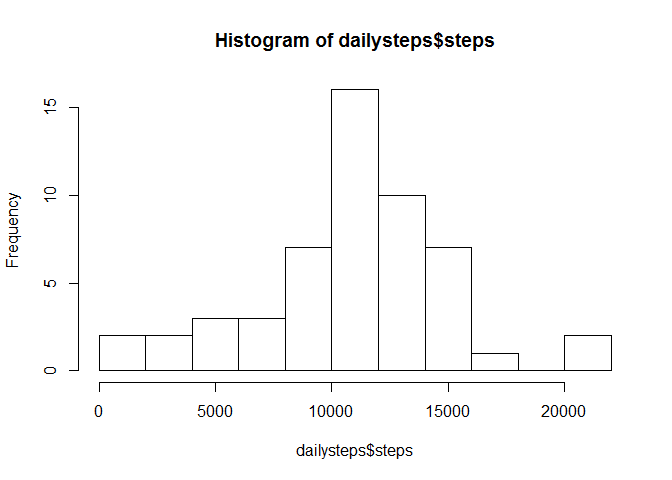
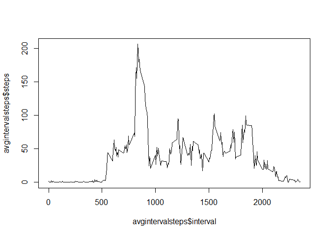
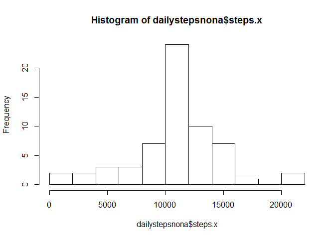
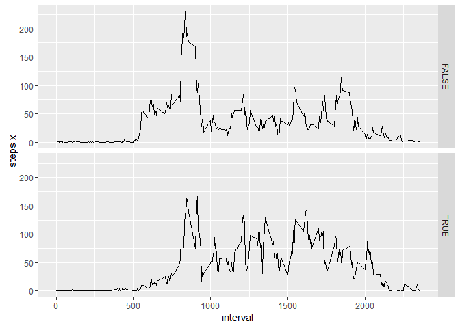

# Reproducible Research: Peer Assessment 1
Brice Hoareau  
24 January 2016  

## Loading and preprocessing the data

Load the data from "activity.csv" and inspect:

```r
activitydata <- read.csv("activity.csv")
summary(activitydata)
```

```
##      steps                date          interval     
##  Min.   :  0.00   2012-10-01:  288   Min.   :   0.0  
##  1st Qu.:  0.00   2012-10-02:  288   1st Qu.: 588.8  
##  Median :  0.00   2012-10-03:  288   Median :1177.5  
##  Mean   : 37.38   2012-10-04:  288   Mean   :1177.5  
##  3rd Qu.: 12.00   2012-10-05:  288   3rd Qu.:1766.2  
##  Max.   :806.00   2012-10-06:  288   Max.   :2355.0  
##  NA's   :2304     (Other)   :15840
```

```r
str(activitydata)
```

```
## 'data.frame':	17568 obs. of  3 variables:
##  $ steps   : int  NA NA NA NA NA NA NA NA NA NA ...
##  $ date    : Factor w/ 61 levels "2012-10-01","2012-10-02",..: 1 1 1 1 1 1 1 1 1 1 ...
##  $ interval: int  0 5 10 15 20 25 30 35 40 45 ...
```

No preprocessing necessary.

## What is mean total number of steps taken per day?

Calculate the total number of steps taken per day:

```r
library(xtable)
```

```
## Warning: package 'xtable' was built under R version 3.2.3
```

```r
dailysteps <- aggregate(formula = steps ~ date, data = activitydata, FUN = sum, na.action = na.omit)
print(xtable(dailysteps), type = "html")
```

<!-- html table generated in R 3.2.2 by xtable 1.8-0 package -->
<!-- Mon Jan 25 00:36:50 2016 -->
<table border=1>
<tr> <th>  </th> <th> date </th> <th> steps </th>  </tr>
  <tr> <td align="right"> 1 </td> <td> 2012-10-02 </td> <td align="right"> 126 </td> </tr>
  <tr> <td align="right"> 2 </td> <td> 2012-10-03 </td> <td align="right"> 11352 </td> </tr>
  <tr> <td align="right"> 3 </td> <td> 2012-10-04 </td> <td align="right"> 12116 </td> </tr>
  <tr> <td align="right"> 4 </td> <td> 2012-10-05 </td> <td align="right"> 13294 </td> </tr>
  <tr> <td align="right"> 5 </td> <td> 2012-10-06 </td> <td align="right"> 15420 </td> </tr>
  <tr> <td align="right"> 6 </td> <td> 2012-10-07 </td> <td align="right"> 11015 </td> </tr>
  <tr> <td align="right"> 7 </td> <td> 2012-10-09 </td> <td align="right"> 12811 </td> </tr>
  <tr> <td align="right"> 8 </td> <td> 2012-10-10 </td> <td align="right"> 9900 </td> </tr>
  <tr> <td align="right"> 9 </td> <td> 2012-10-11 </td> <td align="right"> 10304 </td> </tr>
  <tr> <td align="right"> 10 </td> <td> 2012-10-12 </td> <td align="right"> 17382 </td> </tr>
  <tr> <td align="right"> 11 </td> <td> 2012-10-13 </td> <td align="right"> 12426 </td> </tr>
  <tr> <td align="right"> 12 </td> <td> 2012-10-14 </td> <td align="right"> 15098 </td> </tr>
  <tr> <td align="right"> 13 </td> <td> 2012-10-15 </td> <td align="right"> 10139 </td> </tr>
  <tr> <td align="right"> 14 </td> <td> 2012-10-16 </td> <td align="right"> 15084 </td> </tr>
  <tr> <td align="right"> 15 </td> <td> 2012-10-17 </td> <td align="right"> 13452 </td> </tr>
  <tr> <td align="right"> 16 </td> <td> 2012-10-18 </td> <td align="right"> 10056 </td> </tr>
  <tr> <td align="right"> 17 </td> <td> 2012-10-19 </td> <td align="right"> 11829 </td> </tr>
  <tr> <td align="right"> 18 </td> <td> 2012-10-20 </td> <td align="right"> 10395 </td> </tr>
  <tr> <td align="right"> 19 </td> <td> 2012-10-21 </td> <td align="right"> 8821 </td> </tr>
  <tr> <td align="right"> 20 </td> <td> 2012-10-22 </td> <td align="right"> 13460 </td> </tr>
  <tr> <td align="right"> 21 </td> <td> 2012-10-23 </td> <td align="right"> 8918 </td> </tr>
  <tr> <td align="right"> 22 </td> <td> 2012-10-24 </td> <td align="right"> 8355 </td> </tr>
  <tr> <td align="right"> 23 </td> <td> 2012-10-25 </td> <td align="right"> 2492 </td> </tr>
  <tr> <td align="right"> 24 </td> <td> 2012-10-26 </td> <td align="right"> 6778 </td> </tr>
  <tr> <td align="right"> 25 </td> <td> 2012-10-27 </td> <td align="right"> 10119 </td> </tr>
  <tr> <td align="right"> 26 </td> <td> 2012-10-28 </td> <td align="right"> 11458 </td> </tr>
  <tr> <td align="right"> 27 </td> <td> 2012-10-29 </td> <td align="right"> 5018 </td> </tr>
  <tr> <td align="right"> 28 </td> <td> 2012-10-30 </td> <td align="right"> 9819 </td> </tr>
  <tr> <td align="right"> 29 </td> <td> 2012-10-31 </td> <td align="right"> 15414 </td> </tr>
  <tr> <td align="right"> 30 </td> <td> 2012-11-02 </td> <td align="right"> 10600 </td> </tr>
  <tr> <td align="right"> 31 </td> <td> 2012-11-03 </td> <td align="right"> 10571 </td> </tr>
  <tr> <td align="right"> 32 </td> <td> 2012-11-05 </td> <td align="right"> 10439 </td> </tr>
  <tr> <td align="right"> 33 </td> <td> 2012-11-06 </td> <td align="right"> 8334 </td> </tr>
  <tr> <td align="right"> 34 </td> <td> 2012-11-07 </td> <td align="right"> 12883 </td> </tr>
  <tr> <td align="right"> 35 </td> <td> 2012-11-08 </td> <td align="right"> 3219 </td> </tr>
  <tr> <td align="right"> 36 </td> <td> 2012-11-11 </td> <td align="right"> 12608 </td> </tr>
  <tr> <td align="right"> 37 </td> <td> 2012-11-12 </td> <td align="right"> 10765 </td> </tr>
  <tr> <td align="right"> 38 </td> <td> 2012-11-13 </td> <td align="right"> 7336 </td> </tr>
  <tr> <td align="right"> 39 </td> <td> 2012-11-15 </td> <td align="right">  41 </td> </tr>
  <tr> <td align="right"> 40 </td> <td> 2012-11-16 </td> <td align="right"> 5441 </td> </tr>
  <tr> <td align="right"> 41 </td> <td> 2012-11-17 </td> <td align="right"> 14339 </td> </tr>
  <tr> <td align="right"> 42 </td> <td> 2012-11-18 </td> <td align="right"> 15110 </td> </tr>
  <tr> <td align="right"> 43 </td> <td> 2012-11-19 </td> <td align="right"> 8841 </td> </tr>
  <tr> <td align="right"> 44 </td> <td> 2012-11-20 </td> <td align="right"> 4472 </td> </tr>
  <tr> <td align="right"> 45 </td> <td> 2012-11-21 </td> <td align="right"> 12787 </td> </tr>
  <tr> <td align="right"> 46 </td> <td> 2012-11-22 </td> <td align="right"> 20427 </td> </tr>
  <tr> <td align="right"> 47 </td> <td> 2012-11-23 </td> <td align="right"> 21194 </td> </tr>
  <tr> <td align="right"> 48 </td> <td> 2012-11-24 </td> <td align="right"> 14478 </td> </tr>
  <tr> <td align="right"> 49 </td> <td> 2012-11-25 </td> <td align="right"> 11834 </td> </tr>
  <tr> <td align="right"> 50 </td> <td> 2012-11-26 </td> <td align="right"> 11162 </td> </tr>
  <tr> <td align="right"> 51 </td> <td> 2012-11-27 </td> <td align="right"> 13646 </td> </tr>
  <tr> <td align="right"> 52 </td> <td> 2012-11-28 </td> <td align="right"> 10183 </td> </tr>
  <tr> <td align="right"> 53 </td> <td> 2012-11-29 </td> <td align="right"> 7047 </td> </tr>
   </table>


```r
hist(dailysteps$steps, breaks = 8)
```

 

Histogram of the total number of steps taken each day.


```r
dailymean <- mean(dailysteps$steps)
dailymedian <- median(dailysteps$steps)
```

The mean and median of the total number of steps taken per day are __1.0766189\times 10^{4}__ and __10765__ respectively.

## What is the average daily activity pattern?

Time series plot of the 5-minute interval (x-axis) and the average number of steps taken, averaged across all days:

```r
avgintervalsteps <- aggregate(formula = steps ~ interval, data = activitydata, FUN = mean, na.action = na.omit)
plot(avgintervalsteps$interval, avgintervalsteps$steps, type = "l")
```

 

The 5-minute interval, on average across all the days in the dataset, that contains the maximum number of steps is:

```r
avgintervalsteps[row.names(avgintervalsteps) == which.max(avgintervalsteps$steps),]$interval
```

```
## [1] 835
```

## Imputing missing values

The total number of missing values in the dataset is

```r
sum(is.na(activitydata$steps))
```

```
## [1] 2304
```

Confirm that the other variables do not have NAs:

```r
sum(is.na(activitydata$date))
```

```
## [1] 0
```

```r
sum(is.na(activitydata$interval))
```

```
## [1] 0
```

__Imputing strategy:__ use the interval average calculated in the above section and to replace NAs with interval average.

Calculate the total number of steps taken per day after imputing:

```r
mergedact <- merge(activitydata, avgintervalsteps, by = "interval")
mergedact[is.na(mergedact$steps.x),]$steps.x <- mergedact[is.na(mergedact$steps.x),]$steps.y
mergedact <- mergedact[ order(mergedact[,3], mergedact[,1]), ]

dailystepsnona <- aggregate(formula = steps.x ~ date, data = mergedact, FUN = sum)
print(xtable(dailystepsnona), type = "html")
```

<!-- html table generated in R 3.2.2 by xtable 1.8-0 package -->
<!-- Mon Jan 25 00:36:51 2016 -->
<table border=1>
<tr> <th>  </th> <th> date </th> <th> steps.x </th>  </tr>
  <tr> <td align="right"> 1 </td> <td> 2012-10-01 </td> <td align="right"> 10766.19 </td> </tr>
  <tr> <td align="right"> 2 </td> <td> 2012-10-02 </td> <td align="right"> 126.00 </td> </tr>
  <tr> <td align="right"> 3 </td> <td> 2012-10-03 </td> <td align="right"> 11352.00 </td> </tr>
  <tr> <td align="right"> 4 </td> <td> 2012-10-04 </td> <td align="right"> 12116.00 </td> </tr>
  <tr> <td align="right"> 5 </td> <td> 2012-10-05 </td> <td align="right"> 13294.00 </td> </tr>
  <tr> <td align="right"> 6 </td> <td> 2012-10-06 </td> <td align="right"> 15420.00 </td> </tr>
  <tr> <td align="right"> 7 </td> <td> 2012-10-07 </td> <td align="right"> 11015.00 </td> </tr>
  <tr> <td align="right"> 8 </td> <td> 2012-10-08 </td> <td align="right"> 10766.19 </td> </tr>
  <tr> <td align="right"> 9 </td> <td> 2012-10-09 </td> <td align="right"> 12811.00 </td> </tr>
  <tr> <td align="right"> 10 </td> <td> 2012-10-10 </td> <td align="right"> 9900.00 </td> </tr>
  <tr> <td align="right"> 11 </td> <td> 2012-10-11 </td> <td align="right"> 10304.00 </td> </tr>
  <tr> <td align="right"> 12 </td> <td> 2012-10-12 </td> <td align="right"> 17382.00 </td> </tr>
  <tr> <td align="right"> 13 </td> <td> 2012-10-13 </td> <td align="right"> 12426.00 </td> </tr>
  <tr> <td align="right"> 14 </td> <td> 2012-10-14 </td> <td align="right"> 15098.00 </td> </tr>
  <tr> <td align="right"> 15 </td> <td> 2012-10-15 </td> <td align="right"> 10139.00 </td> </tr>
  <tr> <td align="right"> 16 </td> <td> 2012-10-16 </td> <td align="right"> 15084.00 </td> </tr>
  <tr> <td align="right"> 17 </td> <td> 2012-10-17 </td> <td align="right"> 13452.00 </td> </tr>
  <tr> <td align="right"> 18 </td> <td> 2012-10-18 </td> <td align="right"> 10056.00 </td> </tr>
  <tr> <td align="right"> 19 </td> <td> 2012-10-19 </td> <td align="right"> 11829.00 </td> </tr>
  <tr> <td align="right"> 20 </td> <td> 2012-10-20 </td> <td align="right"> 10395.00 </td> </tr>
  <tr> <td align="right"> 21 </td> <td> 2012-10-21 </td> <td align="right"> 8821.00 </td> </tr>
  <tr> <td align="right"> 22 </td> <td> 2012-10-22 </td> <td align="right"> 13460.00 </td> </tr>
  <tr> <td align="right"> 23 </td> <td> 2012-10-23 </td> <td align="right"> 8918.00 </td> </tr>
  <tr> <td align="right"> 24 </td> <td> 2012-10-24 </td> <td align="right"> 8355.00 </td> </tr>
  <tr> <td align="right"> 25 </td> <td> 2012-10-25 </td> <td align="right"> 2492.00 </td> </tr>
  <tr> <td align="right"> 26 </td> <td> 2012-10-26 </td> <td align="right"> 6778.00 </td> </tr>
  <tr> <td align="right"> 27 </td> <td> 2012-10-27 </td> <td align="right"> 10119.00 </td> </tr>
  <tr> <td align="right"> 28 </td> <td> 2012-10-28 </td> <td align="right"> 11458.00 </td> </tr>
  <tr> <td align="right"> 29 </td> <td> 2012-10-29 </td> <td align="right"> 5018.00 </td> </tr>
  <tr> <td align="right"> 30 </td> <td> 2012-10-30 </td> <td align="right"> 9819.00 </td> </tr>
  <tr> <td align="right"> 31 </td> <td> 2012-10-31 </td> <td align="right"> 15414.00 </td> </tr>
  <tr> <td align="right"> 32 </td> <td> 2012-11-01 </td> <td align="right"> 10766.19 </td> </tr>
  <tr> <td align="right"> 33 </td> <td> 2012-11-02 </td> <td align="right"> 10600.00 </td> </tr>
  <tr> <td align="right"> 34 </td> <td> 2012-11-03 </td> <td align="right"> 10571.00 </td> </tr>
  <tr> <td align="right"> 35 </td> <td> 2012-11-04 </td> <td align="right"> 10766.19 </td> </tr>
  <tr> <td align="right"> 36 </td> <td> 2012-11-05 </td> <td align="right"> 10439.00 </td> </tr>
  <tr> <td align="right"> 37 </td> <td> 2012-11-06 </td> <td align="right"> 8334.00 </td> </tr>
  <tr> <td align="right"> 38 </td> <td> 2012-11-07 </td> <td align="right"> 12883.00 </td> </tr>
  <tr> <td align="right"> 39 </td> <td> 2012-11-08 </td> <td align="right"> 3219.00 </td> </tr>
  <tr> <td align="right"> 40 </td> <td> 2012-11-09 </td> <td align="right"> 10766.19 </td> </tr>
  <tr> <td align="right"> 41 </td> <td> 2012-11-10 </td> <td align="right"> 10766.19 </td> </tr>
  <tr> <td align="right"> 42 </td> <td> 2012-11-11 </td> <td align="right"> 12608.00 </td> </tr>
  <tr> <td align="right"> 43 </td> <td> 2012-11-12 </td> <td align="right"> 10765.00 </td> </tr>
  <tr> <td align="right"> 44 </td> <td> 2012-11-13 </td> <td align="right"> 7336.00 </td> </tr>
  <tr> <td align="right"> 45 </td> <td> 2012-11-14 </td> <td align="right"> 10766.19 </td> </tr>
  <tr> <td align="right"> 46 </td> <td> 2012-11-15 </td> <td align="right"> 41.00 </td> </tr>
  <tr> <td align="right"> 47 </td> <td> 2012-11-16 </td> <td align="right"> 5441.00 </td> </tr>
  <tr> <td align="right"> 48 </td> <td> 2012-11-17 </td> <td align="right"> 14339.00 </td> </tr>
  <tr> <td align="right"> 49 </td> <td> 2012-11-18 </td> <td align="right"> 15110.00 </td> </tr>
  <tr> <td align="right"> 50 </td> <td> 2012-11-19 </td> <td align="right"> 8841.00 </td> </tr>
  <tr> <td align="right"> 51 </td> <td> 2012-11-20 </td> <td align="right"> 4472.00 </td> </tr>
  <tr> <td align="right"> 52 </td> <td> 2012-11-21 </td> <td align="right"> 12787.00 </td> </tr>
  <tr> <td align="right"> 53 </td> <td> 2012-11-22 </td> <td align="right"> 20427.00 </td> </tr>
  <tr> <td align="right"> 54 </td> <td> 2012-11-23 </td> <td align="right"> 21194.00 </td> </tr>
  <tr> <td align="right"> 55 </td> <td> 2012-11-24 </td> <td align="right"> 14478.00 </td> </tr>
  <tr> <td align="right"> 56 </td> <td> 2012-11-25 </td> <td align="right"> 11834.00 </td> </tr>
  <tr> <td align="right"> 57 </td> <td> 2012-11-26 </td> <td align="right"> 11162.00 </td> </tr>
  <tr> <td align="right"> 58 </td> <td> 2012-11-27 </td> <td align="right"> 13646.00 </td> </tr>
  <tr> <td align="right"> 59 </td> <td> 2012-11-28 </td> <td align="right"> 10183.00 </td> </tr>
  <tr> <td align="right"> 60 </td> <td> 2012-11-29 </td> <td align="right"> 7047.00 </td> </tr>
  <tr> <td align="right"> 61 </td> <td> 2012-11-30 </td> <td align="right"> 10766.19 </td> </tr>
   </table>


```r
hist(dailystepsnona$steps.x, breaks = 8)
```

 

Histogram of the total number of steps taken each day.


```r
imputeddailymean <- mean(dailystepsnona$steps.x)
imputeddailymedian <- median(dailystepsnona$steps.x)
```

The mean and median of the total number of steps taken per day are __1.0766189\times 10^{4}__ and __1.0766189\times 10^{4}__ respectively.

After imputing values for NA, the mean and median have changed ever so slightly. However looking at the histogram, it looks like the variance in the data has decreased.

## Are there differences in activity patterns between weekdays and weekends?


```r
mergedact[,"dayname"] <- weekdays(as.Date(mergedact$date), abbr = TRUE)
mergedact[,"weekend"] <- grepl("S(at|un)", mergedact$dayname)

dailystepsnonaweekend <- aggregate(formula = steps.x ~ interval + weekend, data = mergedact, FUN = mean)

library(ggplot2)
```

```
## Warning: package 'ggplot2' was built under R version 3.2.3
```

```r
g <- ggplot(data = dailystepsnonaweekend, aes(x=interval, y=steps.x))
g <- g + geom_path()
g <- g + facet_grid(weekend ~ .)
g
```

 

__CONCLUSION:__ there is more activity during the weekend.
